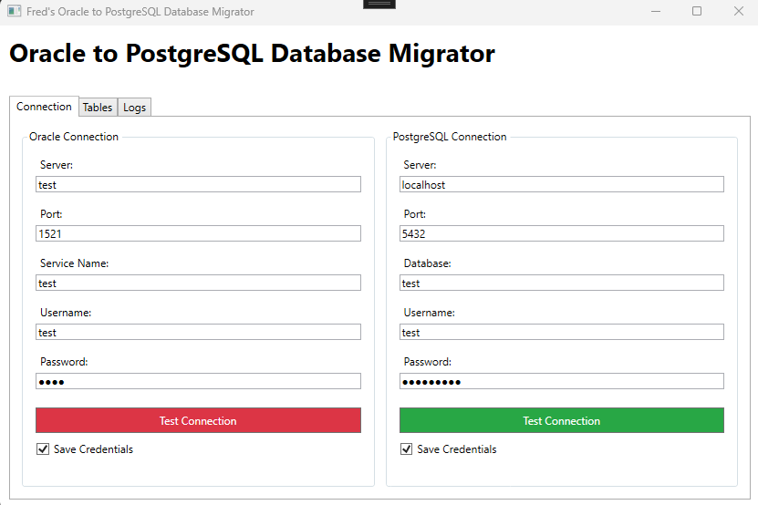

# Fred's Oracle to PostgreSQL Database Migrator

## Description
A Windows desktop application for migrating data from Oracle to PostgreSQL databases. Built with WPF (.NET Framework 4.8).

## Features
- Connection management for both Oracle and PostgreSQL databases
- Secure credential storage with encryption
- Table comparison and selection
- Real-time connection testing with visual feedback
- Detailed logging system
- Search and filter tables
- Modern and user-friendly interface

## Requirements
- Windows OS
- .NET Framework 4.8

## Getting Started
1. Configure your Oracle connection settings
2. Configure your PostgreSQL connection settings
3. Test both connections
4. Use the Tables tab to select and compare tables
5. Monitor the process in the Logs tab

## Security
- All credentials are encrypted before being saved
- Logs are stored in plain text for easy troubleshooting

## Usage

1. Enter the connection details for the Oracle and PostgreSQL databases.
2. Click the "Test Oracle Connection" button to verify that you can connect to the Oracle database.
3. Click the "Test PostgreSQL Connection" button to verify that you can connect to the PostgreSQL database.
4. Click the "Load Oracle Tables" button to load the tables from the Oracle database into the PostgreSQL database.
5. Click the "Load PostgreSQL Tables" button to load the tables from the PostgreSQL database into the Oracle database.

This application uses the Oracle and Npgsql libraries to connect to the databases and the System.Data.DataTable class to load the data from the Oracle tables into the PostgreSQL tables.

The application also uses the Newtonsoft.Json library to serialize and deserialize the data from the Oracle tables into the PostgreSQL tables.

The application is open source and available on GitHub.

The application is licensed under the MIT license and is free to use for any purpose. It is copyright (c) 2025 by Freddy Juhel.